<!-- ===================== HEADER ===================== -->

<p align="center">
  
</p>

<h1 align="center">
  👋 Hey, I'm <span style="color:#00FFFF;">Ankit Pandey!</span>
</h1>

<p align="center">
  
<p align="center">
  <a href="https://git.io/typing-svg">
    
  </a>
</p>
</p>

<p align="center">
  
</p>

---

<!-- ===================== ABOUT ===================== -->

## ⚡ About Me


```cpp
#include <iostream>
using namespace std;

class Developer {

public:

    string name = "Ankit Pandey";
    string role = "Developer";
    string language = "React";

    void introduce() {

        cout << "Hello World! 🚀" << endl;
        cout << "Building something awesome..." << endl;
    }
};
```

🔭 **Currently working on:** Cool projects
🌱 **Currently learning:** Python, DSA & Web Development
💡 **Interested in:** Software Engineering & Open Source
🎯 **Goal:** Become a better developer every day
⚡ **Fun fact:** `while(alive) { keep_coding(); }`

---

<!-- ===================== ANIMATED TERMINAL ===================== -->

## 🖥️ Terminal

```text
┌──(Ankit69Dev)-[~]
└─$ whoami

> Developer
> Programmer
> Problem Solver
> Tech Enthusiast

┌──(Ankit69Dev)-[~]
└─$ ./motivation.sh

🚀 Learn
💻 Build
🧠 Solve
🔥 Repeat
```

---

<!-- ===================== SKILLS ===================== -->

## 🧰 Tech Stack

<p align="center">
  
</p>

<p align="center">
  
  
  
</p>

---

<!-- ===================== STATS ===================== -->

## 🌌 GitHub Universe

<p align="center">
  <a href="https://github.com/Ankit69Dev">
    
  </a>

  <a href="https://github.com/Ankit69Dev?tab=stars">
    
  </a>

  <a href="https://github.com/Ankit69Dev?tab=followers">
    
  </a>
</p>

<p align="center">
  🚀 <b>Building projects • Learning technologies • Solving problems</b> 🚀
</p>


## 📊 GitHub Stats

<p align="center">
  
  
</p>
---

## 🔥 Coding Streak

<p align="center">
  
</p>

---

<!-- ===================== TROPHIES ===================== -->

## 🏆 Achievements

<p align="center">
  <a href="https://github.com/ryo-ma/github-profile-trophy">
    
  </a>
</p>

---

<!-- ===================== PROJECTS ===================== -->

## 🚀 Featured Projects

<p align="center">

<a href="https://github.com/Ankit69Dev/AI-Expense-Tracker">
  
</a>

<a href="https://github.com/Ankit69Dev/Skill-X">
  
</a>

<a href="https://github.com/Ankit69Dev/Weather-app">
  
</a>

</p>

---

<!-- ===================== CONTRIBUTION SNAKE ===================== -->

## 🐍 Watch My Contributions Get Eaten!

<p align="center">
  <picture>
    <source
      media="(prefers-color-scheme: dark)"
      srcset="https://raw.githubusercontent.com/Ankit69Dev/Ankit69Dev/output/github-contribution-grid-snake-dark.svg">

    <source
      media="(prefers-color-scheme: light)"
      srcset="https://raw.githubusercontent.com/Ankit69Dev/Ankit69Dev/output/github-contribution-grid-snake.svg">

    
  </picture>
</p>

---

<!-- ===================== ACTIVITY ===================== -->

## 📈 Contribution Activity

<p align="center">

</p>

---

<!-- ===================== RANDOM DEV ===================== -->

## 💭 Developer Mode

```text
╔══════════════════════════════════════╗
║                                      ║
║     🚀 CODE      →      CREATE       ║
║                                      ║
║     🧠 LEARN     →      BUILD        ║
║                                      ║
║     🔥 FAIL      →      IMPROVE      ║
║                                      ║
║     💻 REPEAT    →      GROW         ║
║                                      ║
╚══════════════════════════════════════╝
```

---

<!-- ===================== CONNECT ===================== -->

## 🌐 Let's Connect

<p align="center">

<a href="https://github.com/Ankit69Dev">

</a>

<a href="nkedin.com/in/ankit-pandey0304/">

</a>

<a href="mailto:pandeyankit0581@gmail.com">

</a>

</p>

---

<!-- ===================== FOOTER ===================== -->

<p align="center">


</p>

<h3 align="center">
  ⭐ Thanks for visiting! ⭐
</h3>

<p align="center">
  <i>"Code. Learn. Build. Repeat. 🚀"</i>
</p>
